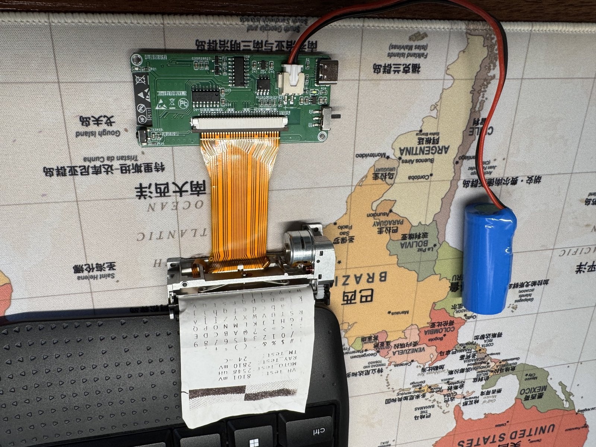
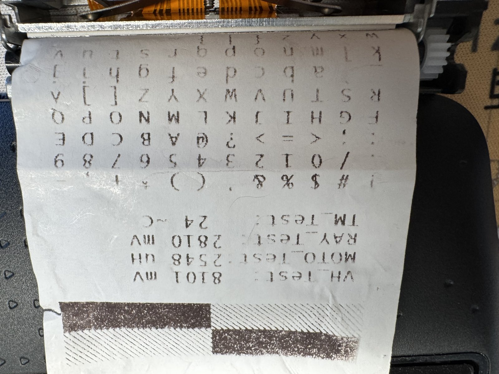
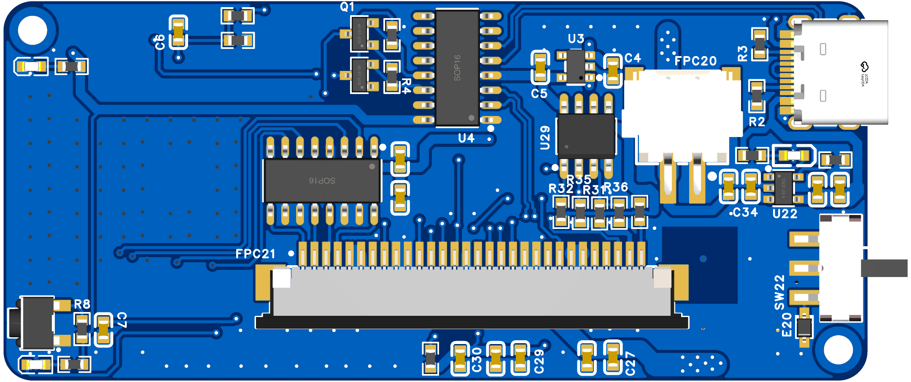
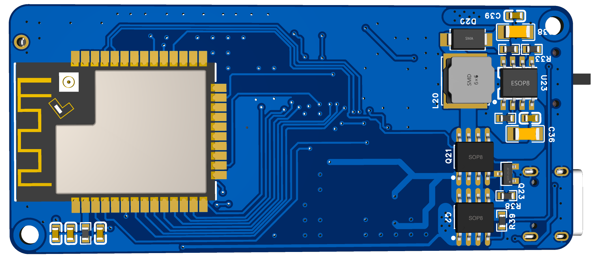

# MINI PRINTER — 便携式蓝牙热敏打印机



电池供电的小型蓝牙热敏打印机：手机通过 BLE 发送单色位图，ESP32 流式缓存并逐行驱动热敏打印头打印。硬件为两层板，锂电池供电，集成充电、升压、电机驱动与多种传感器监测。

**打印测试页**（全字符集 + 校验色块，实测参数：VH 8101mV / 打印头温度 28℃）：



**PCB 3D 视图**：

| 顶面 | 底面 |
|---|---|
|  |  |

> 项目性质：个人复刻/学习项目。硬件参考原始设计（V4 引脚版本）完成，固件经逐行阅读梳理并记录已知问题，手机 App 使用小智学长开源的 Mini-Printer App。

## 文档导航（按阅读顺序）

**一、项目总览**：产品定义、需求拆解、主控选型、系统架构 → [docs/01-项目总览.md](docs/01-项目总览.md)

**二、硬件设计**（[docs/02-硬件设计/](docs/02-硬件设计/)）：

| 章节 | 内容 |
|---|---|
| [01-最小系统](docs/02-硬件设计/01-最小系统.md) | Type-C 供电/烧录电路、CH340C、DTR/RTS 交叉耦合自动下载电路 |
| [02-电源架构](docs/02-硬件设计/02-电源架构.md) | 充电管理、LDO 稳压、AP2005 升压 VH 及 Layout 要点 |
| [03-电量检测与输入指示](docs/02-硬件设计/03-电量检测与输入指示.md) | 分压采样、按键、LED 状态设计 |
| [04-打印模组](docs/02-硬件设计/04-打印模组.md) | 一体化机芯、NTC 测温、光电缺纸检测、TC1508S 电机驱动、FPC 接口 |
| [05-PCB-Layout](docs/02-硬件设计/05-PCB-Layout.md) | 结构约束布局、电源走线、铺铜与 DRC 检查 |

**三、软件设计**（[docs/03-软件设计/](docs/03-软件设计/)）：

| 章节 | 内容 |
|---|---|
| [01-工程结构与任务模型](docs/03-软件设计/01-工程结构与任务模型.md) | 分层架构、FreeRTOS 三任务 + 定时器 + 中断 |
| [02-消息队列](docs/03-软件设计/02-消息队列.md) | 环形打印缓冲（1000 行×48B）与并发安全 |
| [03-LED与按键](docs/03-软件设计/03-LED与按键.md) | 四态指示、消抖状态机 |
| [04-电量采集](docs/03-软件设计/04-电量采集.md) | ADC eFuse 校准、电压→电量换算 |
| [05-BLE通信](docs/03-软件设计/05-BLE通信.md) | Service/Characteristic 模型、收发流程、防丢包设计 |
| [06-缺纸与温度](docs/03-软件设计/06-缺纸与温度.md) | 中断检测、NTC B 值公式、过热保护 |
| [07-步进电机](docs/03-软件设计/07-步进电机.md) | 四相八拍、2ms 节拍、4 步=行高 |
| [08-打印驱动](docs/03-软件设计/08-打印驱动.md) | SPI→LAT→STB 分时加热时序、动态加热补偿、电源时序规则 |

**四、项目整合**（[docs/04-项目整合/](docs/04-项目整合/)）：

| 章节 | 内容 |
|---|---|
| [01-App与整机联调](docs/04-项目整合/01-App与整机联调.md) | 开源 App 对接、图片二值化、A6 开始打印指令的由来 |
| [02-已知问题与修复记录](docs/04-项目整合/02-已知问题与修复记录.md) | 17 条已知问题清单与修复进展 |

**速查参考**：[引脚分配表](docs/pinout.md) · [BLE 协议](docs/ble-protocol.md) · [架构总览](docs/architecture.md)

## 仓库结构

```
mini-printer/
├── hardware/
│   ├── EDA-project/       # 嘉立创EDA专业版工程（.epro2）
│   └── exports/           # Gerber 生产文件 / 原理图 / BOM（可直接打样）
├── software/firmware/     # PlatformIO 工程（ESP32 + Arduino + FreeRTOS）
└── docs/                  # 全部设计文档与图片
```

## 系统概览

- **主控**：ESP32-S 模组（BLE 4.2）
- **打印头**：384 点/行热敏打印头，6 路 STB 分时加热，32Pin FPC 连接
- **走纸**：两相步进电机 + TC1508S 双 H 桥
- **供电**：2000mAh 动力锂电池（Type-C 充电，ME4054），PMOS 软开关机，AP2005 升压 7.2V 供打印头，XC6210 LDO 3.3V 供数字
- **监测**：电池电量（分压+ADC eFuse 校准）、打印头温度（NTC + B 值公式，>65℃ 保护）、缺纸（LM393 + GPIO 中断）

**数据流**：手机 App 编辑排版 --BLE--> ESP32 接收入环形缓冲 --> 打印任务逐行取数 --> SPI 送数 / LAT 锁存 / 6 路 STB 分时加热 + 步进电机走纸 --> 热敏纸成像；全程由电量、温度、缺纸三类监测保护。

### 软件任务模型

| 任务/中断 | 优先级 | 周期/触发 | 职责 |
|---|---|---|---|
| 打印主任务（loop） | 1 | 常驻 | 打印状态机、打印头时序驱动 |
| 上报任务 | 1 | 100ms | 传感器采集 + BLE 上报；缺纸事件处理 |
| 按键任务 | 0 | 10ms | 消抖、短按（自检）/长按（走纸） |
| Ticker 定时器 | — | 2ms/10s/20s | 电机步进 / 状态刷新 / 打印超时 |
| GPIO 中断 | — | 上升沿 | 缺纸检测 |

## 编译与烧录

```bash
cd software/firmware
pio run                # 编译
pio run -t upload      # 烧录（Type-C 直插，板载 CH340C + 自动下载电路）
pio device monitor     # 串口监视
```

环境：PlatformIO，`[env:esp32dev]`，Arduino 框架（依赖 Arduino-ESP32 2.x，3.x 已移除 `ledcSetup` 等接口，建议锁定 espressif32 平台版本）。

## 待办与改进

- [x] ~~实物照片 / 打印效果照片~~（docs/images/）
- [x] ~~原理图、Gerber、BOM 导出~~（hardware/exports/，Gerber 可直接下单打样）
- [ ] 修复 [已知问题](docs/04-项目整合/02-已知问题与修复记录.md) 高优先级四项（按键任务饿死 / A6 误入队 / 低电量显示 / 缓冲残留）
- [ ] 打印耗时实测（验证动态加热收益）
- [ ] 状态包增加包头与校验

## 致谢

- 手机 App：小智学长开源的 Mini-Printer App
- 本项目硬件在原始设计（V4 引脚版本）基础上复刻完成，仅用于个人学习。如有侵权请联系删除。

## License

MIT
