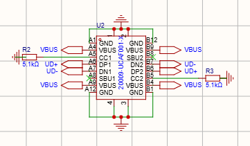
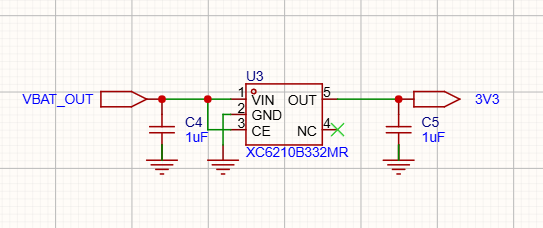
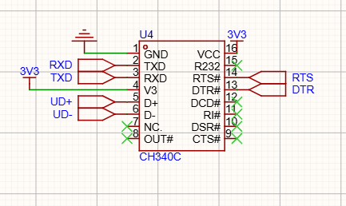
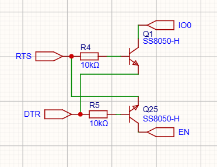

# ESP32 最小系统：供电 / 烧录 / 调试

## 设计目标：一个 Type-C 口解决所有事

上开发板调试那阵子吃过的亏，直接决定了这版最小系统的形态：打印模组的 FPC 排线横跨半个桌子；更难受的是一启动打印，7.2V 加热回路的峰值电流把开发板的 USB 5V 直接拉垮，板子掉电复位，打印一半断掉。所以画自己板子时我给最小系统定了三个硬指标：**一个 Type-C 口同时完成供电、烧录、串口调试；供电路径必须和加热路径彻底分开；烧录不依赖任何手动按键**。前两条约束了电源和接口，第三条催生了后面的自动下载电路。

## Type-C：受电端不是插上就有 5V

接口选 Type-C 没什么悬念，手边全是 C 口线。但 C 口和 Micro-USB 有个本质区别：**VBUS 默认是不供电的**。

Micro-USB 时代插上就有 5V；Type-C 的供电端（DFP）会先在 CC 线上做角色检测——它内部有上拉 Rp，我这块板作为受电端（UFP）必须在 CC1 和 CC2 上各挂一个 5.1kΩ 下拉电阻到地（图中的 R2、R3）。供电端在 CC 上检测到这个标准下拉阻值，才确认对端是个用电设备，闭合自己一侧的 VBUS 开关输出 5V。两个电阻缺一不可：Type-C 正反插时只有一面 CC 接通，只画一个下拉，另一个方向插进去 CC 悬空、检测失败，就成了"这根线能充、那根不能、翻个面又好了"的玄学问题，查起来非常浪费时间。

引脚分配上：VBUS 四个脚（A4/A9/B4/B9）全部并在一起取电，GND 同理全接地；数据只用了 USB 2.0 那一对差分线，A 面 A6/A7（DP1/DN1）和 B 面 B6/B7（DP2/DN2）同名短接，保证正反插都能通到 UD+/UD-；SBU1/SBU2 直接打叉悬空，那是 USB 3.0 和 DP Alt Mode 用的，本设计用不上。VBUS 进板后挂了两颗去耦电容，然后直接进充电 IC——供电路径就此交给充电/电源那部分，和 3.3V 这边完全解耦，这就是当初"加热不拖垮调试供电"诉求的落实。

## 3.3V 主电源：为什么是 LDO，为什么是 XC6210

先盘负载。从网表数了一下 3V3 网络上挂的东西：ESP32-S 模块本体、CH340C、打印模组 FPC 上的逻辑电源脚、七八颗信号上拉电阻（EN、指示灯驱动这些）、五颗去耦电容。平均电流不大，真正的尖峰来自 ESP32 开 WiFi 的瞬间——datasheet 里瞬时能到几百 mA，但只是毫秒级的突发。

第一直觉是抄 ESP8266 时代的老方案 AMS1117-3.3，便宜又好买。算了一下压差就放弃了：AMS1117 压差典型 1.1V，意味着输入要 4.4V 以上才能稳住 3.3V；而这块板的 LDO 输入是 VBAT_OUT（电池经软开关后的电压，3.3~4.2V 区间），电池一放到 4V 以下就掉出稳压区，3.3V 开始跟着电池电压滑坡，ESP32 直接工作在不稳定供电上。所以换成了低压差的 XC6210B332MR：压差在百毫伏量级（随负载电流增大），700mA 额定输出，盖住 WiFi 尖峰没有问题；SOT-23-5 封装，面积也好安排。

也考虑过同步 DCDC，效率数字确实好看，但最后还是否了：真正耗电的打印头走的是另一路 7.2V boost，3.3V 一侧平均负载小，省那点电意义不大；而打印头就贴在板边，DCDC 几百 kHz 的开关纹波一旦耦合进热敏头的数据线，打出来的内容就是一条条纹路——这种问题在板子做好之后很难定位。LDO 没有开关噪声，代价只是热：(4.2−3.3) V × 平均电流，这个量级完全在 SOT-23 的散热能力之内。

外围按手册最小配置：输入 C4、输出 C5 各 1µF。CE 脚直接接到 VBAT_OUT、常开——3.3V 一侧没有需要单独断电的负载，整机的电源开关已经在 VBAT_OUT 那一级用 PMOS 做了（见下一节），这里再做一个使能就是重复控制。

## USB 转串口：CH340C

Type-C 出来的 UD+/UD- 差分对直接进 U4（CH340C）。选 C 而不是更便宜的 CH340G，就一条理由：**C 内置振荡器**，省掉 12MHz 晶振和两颗负载电容，也省掉晶振布线要远离干扰源、不走跳线这些讲究——BOM 少三件，布局少一处麻烦。

供电接 3.3V，V3 脚按手册 3.3V 供电的接法与 VCC 相接。串口侧是交叉连接：CH340C 的 TXD 接 ESP32 的 RXD0，RXD 接 ESP32 的 TXD0——"发"永远对"收"，直连的话两边都是发，谁也听不见谁。这一点在画图的时候就要留神，原理图上网络名一顺（TXD 对 TXD）就是直连的坑。

引脚处理上只留了四根有用的：TXD、RXD、DTR#、RTS#。DTR/RTS 是给下一节自动下载电路用的控制脚；其余 modem 信号（CTS#/DSR#/RI#/DCD#、OUT#、R232）全部打叉悬空——半双工打印调试用不上流控。

驱动侧没什么可说的：Windows 装沁恒官方驱动，设备管理器出现 COM 口，PlatformIO 的 upload_port 指过去，`pio run -t upload` 直接烧。

## 自动下载电路：两支三极管的交叉耦合

这块板在 IO0 和 EN 上**一颗按键都没留**——BOOT 和 RESET 都没有。不是我忘了，是这套电路把它们替代掉了。

先看 ESP32 怎么进下载模式：复位瞬间采样 IO0，为高则正常启动，为低则进入 ROM 里的 UART 下载模式。所以手动烧录的标准动作是"按住 BOOT、点一下 RST、松开"。要让电脑上的 esptool 自动完成这个动作，就需要能用电平分别控制 IO0 和 EN。

电路用了两支 SS8050（NPN），接法刻意交叉：

- **Q1**：基极经 R4（10k）接 RTS，**发射极接 DTR**，集电极接 IO0；
- **Q25**：基极经 R5（10k）接 DTR，**发射极接 RTS**，集电极接 EN。

关键就在发射极不接地、而是落在对方的信号网络上。NPN 导通的条件是 VB − VE > 0.7V，对 Q1 来说就是"RTS 高且 DTR 低"，对 Q25 来说是"DTR 高且 RTS 低"。把四种组合全列出来：

| DTR | RTS | Q1 | Q25 | 效果 |
| --- | --- | --- | --- | --- |
| 高 | 高 | 截止 | 截止 | 无动作 |
| 低 | 低 | 截止 | 截止 | 无动作 |
| 低 | 高 | **导通** | 截止 | IO0 被拉低 |
| 高 | 低 | 截止 | **导通** | EN 被拉低（复位） |

中间两行就是烧录时 esptool 打出的组合：先把 IO0 拉低，再给 EN 一个负脉冲然后释放——复位释放的瞬间 IO0 仍为低，芯片就落在下载模式里，接下来数据全走串口进 Flash。全程不用碰板子。

而上下两行（DTR、RTS 同电平）两管 VBE = 0、全部截止，这是这套电路真正的价值：**串口工具只要 DTR/RTS 同电平，随便怎么开关，复位脚纹丝不动**。如果直接把 DTR 接 EN 做复位，打开串口监视器的瞬间板子就重启——因为很多终端默认会拉低 DTR/RTS——那种"一开监视器就重启循环"的板子我用过，印象深刻，所以这次坚决用交叉耦合。

顺带一提 EN 网络上的另外两个器件：R1 上拉到 3V3、C3 接地。上拉保证 EN 平时稳在高电平；RC 组合兼顾上电复位（3.3V 爬升过程中给 EN 一个足够长的低电平窗口让芯片可靠复位）和毛刺滤波（电源上的尖峰不至于误触发复位）。这两个小件不起眼，但少了它们，低温下上电偶发"起不来"的问题很难查。

到这里最小系统闭环了：插线即供电、枚举出串口、一键烧录、监视器随便开。后面所有外围电路——充电、电源树、打印模组——都挂在这套底座上。
