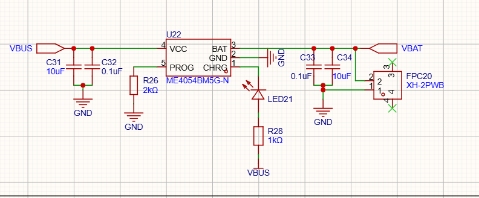
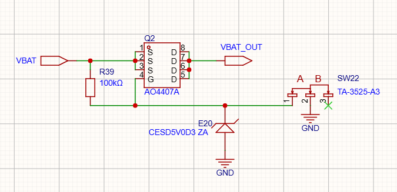
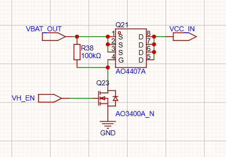
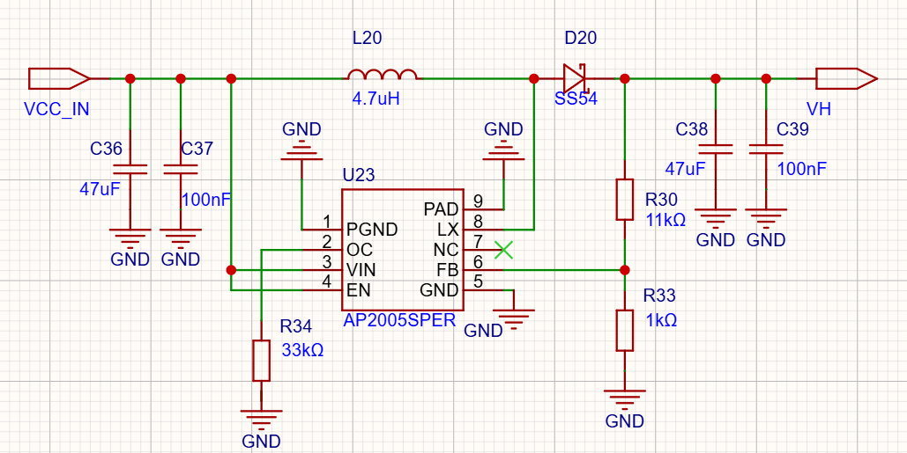

# 电源架构

## 先看全景：一棵两分支的电源树

画原理图之前我先把整机的供电路径画在纸上，因为它决定了后面每一颗器件的位置：

```
Type-C VBUS 5V ──> ME4054 充电 ──> 2000mAh 锂电池（XH2.54 座）
                                        │ VBAT
                                   Q2 PMOS ◄── SW22 拨动开关
                                        │ VBAT_OUT
              ┌─────────────────────────┼─────────────────┐
              ▼                         ▼                 ▼
        XC6210 LDO → 3.3V        Q21 PMOS ◄── VH_EN     R6/R7 分压
        （最小系统一节）               │ VCC_IN          → POWER_ADC
                                       ▼
                              AP2005 Boost → VH 7.2V
                                       │
                                       ▼
                                  打印头加热
```

三条规矩从上往下读：**充电在总开关之前**——关着机插线也能充电；**数字电和加热电彻底分家**——3.3V 由 LDO 供，加热 7.2V 由 boost 供，互不拖累（最小系统一节里"加热拖垮调试供电"的教训就是在这里还的）；**每一级都有自己的闸**——总闸是拨动开关，加热闸是 VH_EN，单级想断就断。电量检测的分压（R6/R7）也挂在 VBAT_OUT 上，细节放下一节讲。

## 充电：ME4054 线性充电



充电芯片选了 ME4054BM5G-N（TP4054 同类）。选线性而不是开关型充电，是因为这个项目充电电流小，线性方案外围只要几个电容电阻、成本几毛钱、还没有开关噪声——开关充电省下来的那点效率，在 500mA 档位上没有意义。

充电电流由 PROG 脚的 R26 决定：I = 1000V / R_PROG，R26 取 2kΩ，正好 500mA。定 500mA 不是随手写的：**Type-C 口在不跑 PD 协议时，默认电流预算就是 500mA**（USB 2.0 标准），充电电流定得比这高，插电脑上前端就可能过载掉电。想快充就得加 PD 芯片，为这个项目不值。

指示电路就一颗 LED：CHRG 脚是开漏输出，充电中被拉低，LED21 经 R28（1k）从 VBUS 取电点亮；充满后 CHRG 变高阻，灯灭。单灯只报"正在充"，不报"充满"，够用。

输入输出各是一对大小电容（10µF + 100nF）：大电容兜低频、小电容兜高频，这是全板通用的搭配。热是线性充电绕不开的账：损耗 = (VBUS − VBAT) × 电流，电池满电时 0.4W，亏到 3V 时 1W——SOT23-5 的小身板扛不住 1W，好在 ME4054 内部带热调节，过热自动降流，代价是电池越空充得越慢。2000mAh 按 500mA 充，CC-CV 全程走完实测要 5 小时上下，睡前插上正好。拔线之后芯片从电池倒灌的电流只有微安级，不用额外加防倒灌。

## 总电源开关：拨动开关 + PMOS，而不是"软开关"



电池设备需要一个真正意义的断电。当时摆着两条路：

第一条，开关直接串在电池回路上。否掉——boost 输入侧的峰值电流要到 3A 以上，而拨动开关这种小身材的触点额定只有 50mA 量级，直接串进去就是拿触点当保险丝。

第二条，"一键开机 + 固件保电"的软开关（按一下，MCU 启动后用一个 GPIO 拉住电源）。也否掉了——那意味着 MCU 要常供电、要管理休眠电流、软件挂死就关不了机，而且长期放在抽屉里会持续漏电。

最后用的是图里的结构：**拨动开关只管 Q2（AO4407A，P 沟道 MOSFET）的栅极，功率路径全部走 MOS 管**。开关里流过的只有微安级的栅极电流，而 AO4407A 的导通内阻是毫欧级，3A 电流过它压降可以忽略。

原理一句话：Q2 源极接 VBAT、漏极接 VBAT_OUT，R39（100k）把栅极上拉到源极，Vgs = 0，默认关断；SW22 拨到导通档，栅极被拉到地，Vgs = −VBAT，管子导通，VBAT 接通到 VBAT_OUT。注意这是高侧开关——断的是正极而不是地，整机地平面保持完整，测量调试时万用表黑表笔永远有地方放。

E20（CESD5V0D3）是栅极网络对地的 ESD 钳位。MOS 管的栅极是静电敏感结构，拨动开关又装在板边、人手天天摸，这颗管子是给栅极上保险。电池放到 3.0V 时 |Vgs| = 3.0V，仍远高于 AO4407A 的导通阈值，只是内阻略微上升，毫欧级的基础上无感。

拨到 OFF，整机电流真正归零——放一年也不亏电。这是机械开关唯一比电子方案强的地方，而它恰恰是电池设备最需要的。

## 7.2V 加热电源：两级结构

### 为什么打印头要 7.2V

热敏打印头的加热电压 VH 标称就是 7.2V 档：384 个加热点要毫秒级升温到发黑温度，功率密度摆在那，电压不够就只能拉长加热时间，打印速度直接掉。电池的 3.0~4.2V 差着一倍，必须升压。而 ESP32 供电只要 3.3V——所以加热电源做成从 VBAT_OUT 独立分出来的一支，自己的开关、自己的变换器。

### 第一级：VH 使能开关



加热电源的通断由 ESP32 的 GPIO（固件里叫 VH_EN）控制，但 GPIO 推不动大电流，这里用两支管子搭了一级电平搬移：

- **Q23**（AO3400A，N 沟道）：栅极接 VH_EN，源极接地；
- **Q21**（AO4407A，P 沟道）：源极接 VBAT_OUT，漏极输出 VCC_IN，栅极经 R38（100k）上拉到源极、同时被 Q23 的漏极下拉。

VH_EN 给高，Q23 导通把 Q21 的栅极拉到地，Q21 导通，VBAT_OUT 接到 VCC_IN；VH_EN 给低或悬空，R38 把 Q21 栅极拉回源极电位，通路断开。R38 的存在意味着**加热电源默认是断的**——MCU 复位、死机、还在下载模式时 GPIO 悬空，加热回路必须处于关断状态，这是安全底线，不交给软件自觉。

为什么不用 AP2005 自带的 EN 脚做开关（那只要一根 GPIO 直连）？算过一笔账：EN 只是停掉开关动作，输出端的分压电阻（下文的 R30/R33）是常挂在 VH 上的，7.2V / 12k = 600µA 的常耗，待机一天白掉 14mAh。用 Q21 在源头一刀切断，VH 整个网络掉到 0V，待机功耗真正归零。多两颗管子，换一个干净的关断。

### 第二级：AP2005 升压



VCC_IN 进来后就是一颗标准 boost：U23 选了芯朋微的 AP2005——1MHz 固定频率电流模式 PWM，功率管内置（0.05Ω / 4.5A / 12V），外围只要电感、二极管、电容和两颗分压电阻，内置软启动和 12V 过压保护。1MHz 的开关频率换来的是电感可以做小，代价是布局敏感，这段的走线讲究全部记在 PCB Layout 那一节。

输入侧 C36（47µF）+ C37（100nF）一对大小电容兜住输入纹波——boost 的输入电流是叠加了开关纹波的脉冲电流，没有这对电容，纹波会一路倒灌回 VBAT_OUT 去祸别处。

功率级三件套：

- **L20（4.7µH）**：手册推荐区间 3.3~4.7µH 的上限值，取大电感纹波电流小，加热这种持续重载场景合适；
- **D20（SS54 肖特基，40V / 5A）**：反向耐压对 7.2V 输出余量充足，电流能力盖住芯片 4.5A 的限流上限，肖特基的低正向压降直接就是效率；
- **输出电容四颗并联**：C38（47µF/10V）打底储能，C27（4.7µF）+ C28、C39（100nF）收高频纹波。特别记一笔：X5R 大容值电容在直流偏压下容值会明显缩水，47µF 挂在 7.2V 上实际有效容值要打折，这正是再并一颗 4.7µF 的原因——标称值会骗人，有效值不会。

输出电压由反馈分压决定：R30（11k）/ R33（1k），VH = 0.6V × (1 + 11/1) = **7.2V**。R30 是 5% 精度、R33 是 1%、基准自带 ±2%，算下来 VH 实际会在 7.2V ±0.5V 内浮动——这里不需要更准，热敏头的加热能量最终靠固件控制加热时间来调（软件设计里加热补偿那套逻辑），VH 只是"够力的电源"，不是"精密基准"。

R34（33k）接在 OC 脚和地之间，把内部峰值限流点设在规格上限 4.5A：加热是脉冲负载，瞬间电流本来就该放开，过流保护只兜真正的故障。EN 脚直接接 VCC_IN——使能权已经完全交给前级的 Q21，这一级不再做开关，两级控制各管一段，逻辑不重叠。

到这里电源树闭环：插线充电、拨动开机、LDO 喂数字、GPIO 控加热。电池还剩多少电怎么知道——R6/R7 那两颗分压电阻的事，下一节讲。
