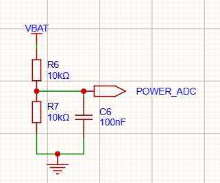
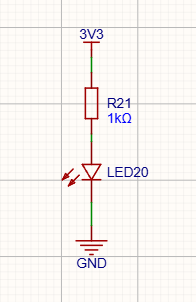
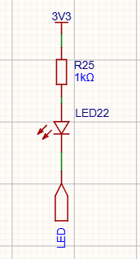
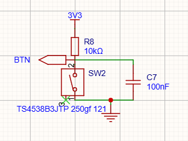

# 电量检测与人机交互

一台没有屏幕的设备，用户能感知它的方式只有三种：还剩多少电、按了有没有反应、灯亮不亮。这三个交互分别对应本节的三小块电路。共同点是便宜、省电、够用——每块的器件数都在三颗以内。

## 电量检测：两颗电阻一个 ADC 口

电池电压 3.0~4.2V，ESP32 的 ADC 满量程在默认衰减档下到不了 4.2V，直接测会削顶，所以先分压：R6、R7 各 10k 串联，VBAT 打对折送到 POWER_ADC（U1 第 6 脚），固件里读到的数乘 2 就是电池电压。

阻值是权衡出来的。往上加（比如 100k+100k），漏电从 210µA 降到 21µA——好看；但 ADC 内部采样电容充电需要低阻抗源，源阻抗太高读数就会飘。最后定 10k+10k 的中庸方案，再补两个措施把两头都占住：**C6（100nF）挂在 ADC 脚上**，采样瞬间由电容供出电荷，等效源阻抗问题直接消失；**用 analogReadMilliVolts() 读数**，它走 ESP32 出厂 eFuse 校准的毫伏通道，比裸 analogRead 换算的精度高一截。

分压取点是 VBAT、在电源开关的上游——这里有个取舍值得记一笔。代价是关机存放时 R6/R7 一直在耗电：4.2V / 20k ≈ 210µA，2000mAh 的电池空放几个月就亏掉一截；好处是插着线充电时即便总开关关着，也能读到电池电压。如果做下一版，我会把取点挪到 VBAT_OUT 下游、或者给分压加一颗高边开关——用一颗料换掉这 210µA。

电压到百分比的换算不是线性的——锂电 3.7V 平台上大半段电量挤在 3.9V~3.65V 之间，直接按比例换算会"前半段掉得慢、后半段崩得快"。固件里做了分段查表标定，这属于软件的活，记在软件设计那一节。

## 指示灯：一颗报"活着"，一颗报"在忙"

**LED20 是电源灯**：3V3 经 R21（1k）直接点亮，接地。LDO 一出电它就亮——这颗灯本质上是 3.3V 电源的物理指示，装在调试期特别有用：板子有没有起来、复位是掉电型还是看门狗型，抬眼就有。结构上它和 GPIO 无关，纯硬件行为。

**LED22 是状态灯**：接法反过来——3V3 经 R25（1k）进 LED，出端接 GPIO（固件里的 LED 信号）。GPIO 拉低，电流从 3.3V 一路灌进引脚，灯亮；GPIO 拉高（或悬空成输入），两端没有压差，灯灭。**低电平点亮、靠灌电流驱动**：ESP32 的单脚灌电流能力（数十 mA）比拉电流可靠，1.3mA 左右的点亮亮度对 0603 小灯来说绰绰有余。

一颗状态灯要表达所有状态，靠闪码：待机慢闪、BLE 连上常亮、打印中快闪、低电量双闪。闪码协议表放软件节，硬件这里只需要知道：**灯的语义是软件定义的，硬件只负责"能亮、能灭、省电"**。

## 按键：一颗轻触开关的完整礼遇

SW2 是最常见的六脚轻触开关（TS4538）。电路三件套：R8（10k）上拉到 3V3 保证平时是稳定高电平，SW2 按下把 BTN 拉到地，C7（100nF）跨在 BTN 和地之间。

值得说的是 C7 这颗电容，它是**硬件去抖**。机械触点闭合瞬间会弹跳几毫秒到十几毫秒，电平在高低位之间抖若干次，纯软件方案要靠延时消抖；有了 C7，抖动的能量先被电容吸收，BTN 上的电平是缓变而不是抖变——R8 10k 与 C7 100nF 的时间常数约 1ms，把弹跳的高频成分滤掉了大半。固件里再做一层 20ms 的软件去抖（双重保险，顺便防长按误判），两层加起来，按键的可靠性就不是玄学而是算得出来的。

按键功能在固件里是长按开关 BLE（防误触），单击不做事——一个物理按键一个职责，语义干净。

三块电路加起来 BOM 不到十颗料、成本几毛钱，换来的是设备"可感知、可交互"的最小闭环。至于打印机自己的两个传感器——打印头温度和缺纸检测——它们不属于"人机交互"，跟着打印模组的 30pin 接口走，下一节展开。
