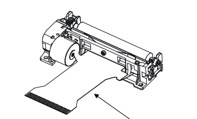
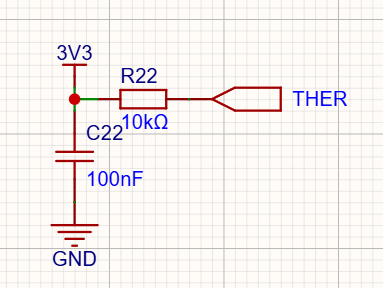
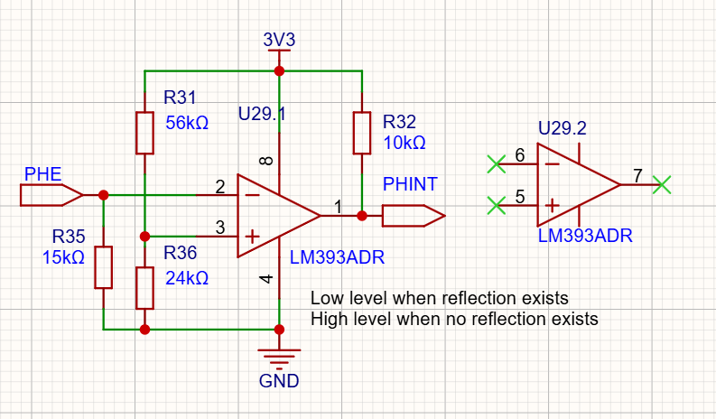
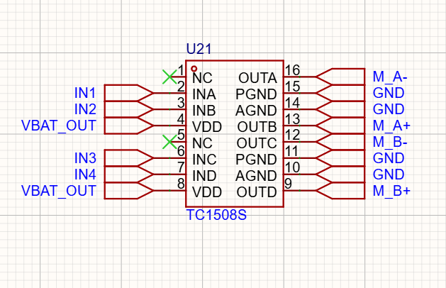
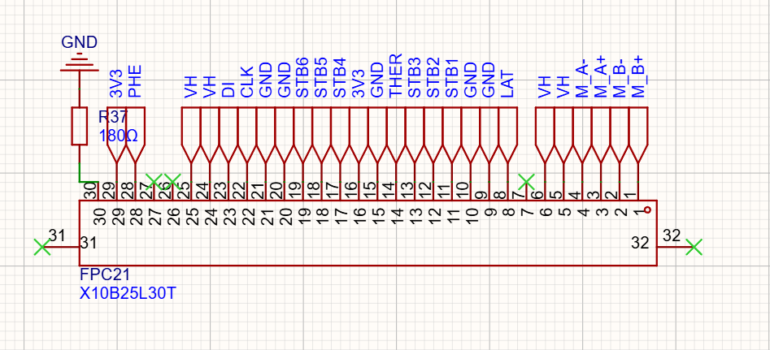
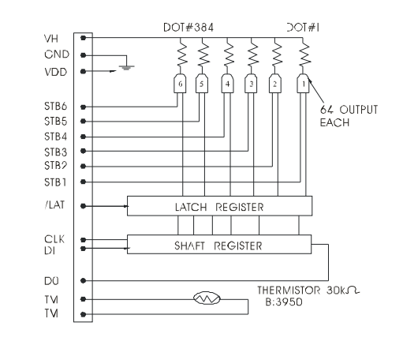

# 打印模组

这个项目里真正难的电路不是我自己画的，是**把一颗现成的打印机芯正确地接进来**。打印模组选的是一体化机芯：打印头、走纸电机、热敏电阻、缺纸传感器全部封装在里面，对外只引出一条 FPC 软排线，结构紧凑且稳定——热敏头是精密件，自己做既做不出来也不值得做，选型时"一体化"就是硬指标。主板这边的任务，是把这 30 根线伺候好。下面按四个子模块展开：温度监测、缺纸侦测、电机驱动、接口与点阵逻辑。

## 热敏电阻驱动：守住打印头的温度上限

热敏打印的原理是加热让热敏纸变色，而打印头如果长时间持续加热，就有损坏的风险——所以温度监测不是锦上添花，是保命的。打印头里内置了热敏电阻（NTC，标称 30kΩ、B 值 3950）做温度监测。

因为不需要高精度的温度测量，电路就做得特别简单：TM 一端接地，另一端接 THER 口，主板上 R22（10k）从 3V3 上拉，和 NTC 构成分压；分压供电节点就近放一颗 C22（100nF）去耦稳住上端。R22 选的 1% 精度——分压误差主要来源就是这颗电阻，加一分钱买 1% 就能把这点误差压下去，值。

换算链路是三步：

1. **ADC 读电压**：固件用 analogReadMilliVolts() 直接读 THER 的毫伏值（走 ESP32 出厂校准通道，比裸读再换算准）；
2. **分压公式反推阻值**：V = 3.3 × R_NTC / (R_NTC + 10k)，反解出 R_NTC = 10k × V / (3.3 − V)；
3. **B 值公式转温度**：T = 1 / (1/T₀ + ln(R/R₀)/B)，T₀ = 298.15K、R₀ = 30k、B = 3950。嫌公式麻烦也可以直接查规格书的 RT 表，一个萝卜一个坑。

这颗温度值在固件里干两件事：超过 65℃ 立即停止加热（硬保护）；以及作为动态加热补偿的输入——温度越高、加热余量越小，每行的加热时长要相应收紧。R22 取 10k 还有个私心：10k 配 30k 的 NTC，40~80℃ 工作区间正好落在分压曲线最陡的一段，ADC 的分辨率都花在刀刃上。

## 缺纸侦测：反射式光电 + 比较器

打印机工作时必须放纸，没纸还继续打，轻则打印异常、白费一截热敏纸，重则热敏头直接加热在胶辊上——所以缺纸检测是启动加热前的先决条件，固件的规矩是：**缺纸状态下，不启动打印加热**。

信号链从左到右三段：**模组内的反射式光电通断传感器 → 主板上的比较电路 → 输出**。

光电传感器的原理：发射管发出光，有纸时，光被纸面反射回来、由接收管接收，输出低电平；缺纸时，光无法被反射，接收管收不到，输出高电平。发射管由 3V3（FPC 29 脚）供电、从 30 脚经 R37（180Ω）回流到地——180Ω 把发射管电流定在 10mA 出头。

我的板上这段"比较电路"用的是 LM393：PHE 信号进比较器负端，R35（15k）做下拉；正端是 R31（56k）/R36（24k）从 3V3 分出来的 0.99V 阈值。PHE 高于阈值，比较器输出低（有纸）；低于阈值，输出高（缺纸）。LM393 是开漏输出，R32（10k）上拉到 3V3 后送进 ESP32 的 GPIO——**干净的高低电平，可以直接挂中断，缺纸瞬间就能停机**，不用软件轮询采样再判阈值。这是不用 ADC 测缺纸的原因：二值事件就交给比较器，模拟量才值得占一个 ADC 通道。

另外灵敏度是硬件可调的：纸张反射率不同的场景，换一颗 R36 阈值就跟着变，不用动固件。LM393 是双比较器封装，这里只用了其中一路，另一路输入输出全悬空留着。

## 电机：拖纸前进的执行器

打印机的原理是逐行打印：打完一行，电机拖拽打印纸往前行进一个行高，循环往复完成多行打印。机芯里是一颗额定电压 3.5~8.5V 的两相步进电机——步进的好处是走多少由脉冲数决定，行高 0.25mm 精确可控，开环就能用。

驱动选型上踩过一点功课。两相步进是双极性接法，两个绕组的电流方向都要能正反切，这决定了必须要 H 桥。教科书级的方案是 L293D/L298，但都不推荐：这两颗老芯片太贵，效率也低（L298 内部是达林顿管，压损大），为此多花十几块钱不值。最后选了 **TC1508**：双通道 H 桥，电源电压和输出电流都轻松覆盖这颗电机的需求，价格零头都不到，接线也特别简单——电机的四根线分别接到 OUTA~OUTD，INA~IND 接到主控的四个 GPIO（U1 的 37/36/33/31 脚）就完事。

功率从 VBAT_OUT 直接取，不走 7.2V 的 VH：电机负载不重，电池电压落在它 3.5~8.5V 的额定区间内绰绰有余，也避免和加热抢 boost 的功率余量。通电顺序是固件里的半步 8 拍表（IN1~IN4 的八种组合循环），2ms 一拍，4 拍走一个行高 0.25mm，即 0.0625mm/拍——这块逻辑全在软件章节。

## 打印接口：30pin FPC 把一切串起来

打印头用的是 1mm 间距 30pin 的 FPC 连接器，下接式，端子走的立创商城（料号 C500182），满足供电、信号控制、传感器相关的全部连接。按打印头的信号线序梳理，需要控制的信号有：

| 分组 | 引脚 | 网络 |
| --- | --- | --- |
| 加热电源 VH | 5/6/24/25 | 7.2V，四脚并联过流 |
| 逻辑电源 | 16/29 | 3V3（模组内驱动芯片的 VDD） |
| 地 | 9/10/15/20/21 | GND，五脚并联 |
| 打印数据 | 8/22/23 | LAT / CLK / DI |
| 加热选通 | 11/12/13/17/18/19 | STB1~STB6 |
| 步进电机 | 1/2/3/4 | M_B± / M_A± |
| 温度反馈 | 14 | THER |
| 缺纸反馈 | 28 | PHE |
| 传感器供电 | 29/30 | 3V3 供电，30 脚经 R37（180Ω）回流 |

VH 是打印加热电源，要 7.2V，而且**不打印时必须关掉**——所以这一路加了电源控制 IO（VH_EN），7.2V 怎么生成的整个链路（boost + 使能开关）记在电源管理那一节。STB1~6 是通道选择器，接到主控的 IO；LAT/CLK/DI 是锁存、时钟、数据三根线，也接主控 IO，电平 3.3V 直连不用转换。

最后这张逻辑图是模组内点阵驱动芯片的内部结构，384 个点怎么点亮全在里头。**数据通路是"串行进、并行出"两级寄存器**：DI 串行进数据，CLK 每拍往 384 位移位寄存器里塞一位（一行 384 点 = 48 字节，固件里走 SPI）；**LAT 拉一下低，当前 384 位整体快照进锁存器**——移位和加热从此解耦，移下一行数据时头正在打上一行，流水线转起来。**输出级是 6 组 × 64 点**，每组一个 STB：384 个点同时通电是几十安的量级，谁也顶不住，STB1~6 把一行拆成 6 段分时加热，峰值电流除以 6，热量也在时间上摊开。固件打印一行的动作：SPI 送 48 字节 → LAT 锁存 → STB1 加热 → …… → STB6 结束 → 走纸 → 下一行。图里 TM 两脚之间的 NTC 就是热敏电阻一节的温度来源。

到这里打印模组四个子模块闭环：热敏电阻管温度上限、光电侦测管有纸没纸、H 桥管走纸、FPC 上的三根数据线加六根选通线管点阵。剩下的 PCB Layout，是把以上电路在物理世界落地的故事，放下一节。
