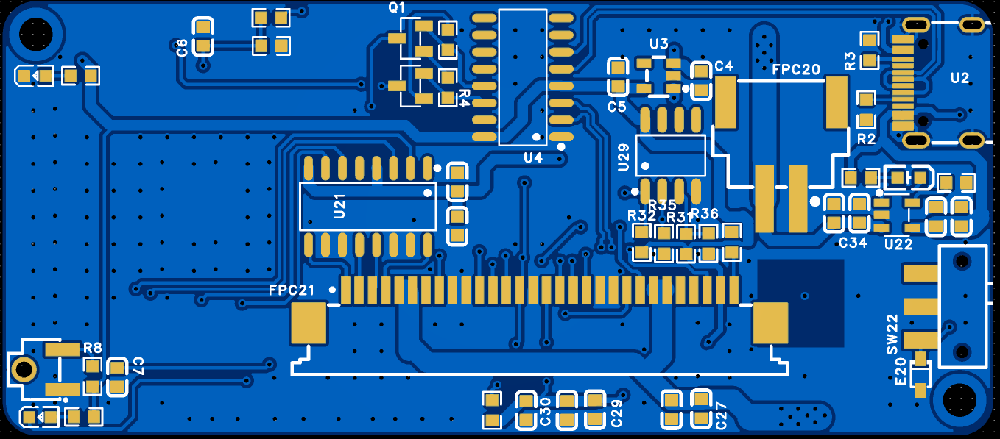
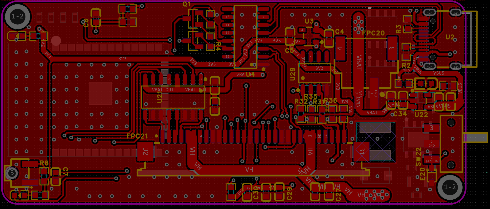
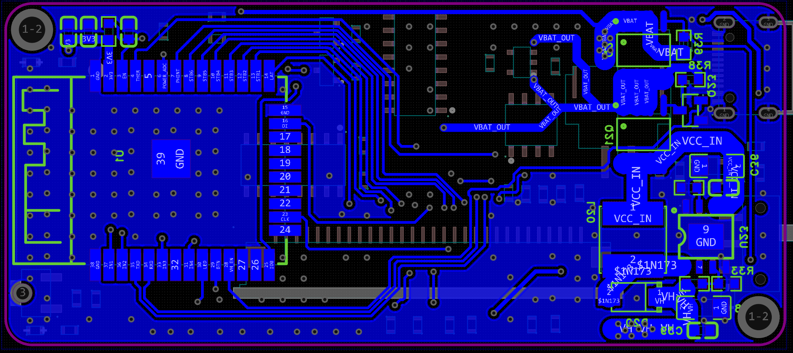
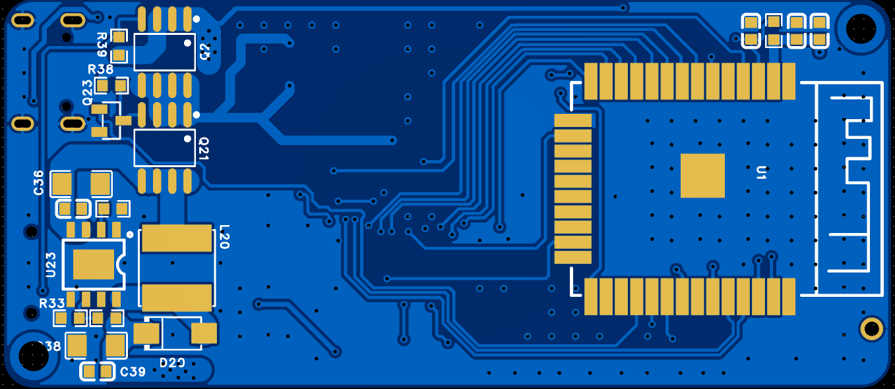

# PCB Layout

原理图解决了"电路对不对"，Layout 解决的是"这块板打出来能不能用"。这个项目的板子是一块**2 层板**——不是预算所迫的将就，是算过账的决定：信号速率最高就是 1MHz 的 SPI 和 USB 2.0 全速，2 层完全扛得住；真正的挑战只有两条，**7.2V 加热的大电流路径**和**1MHz boost 的开关噪声**，这两条靠布局和铺铜处理，不需要靠叠层堆出来。

## 布局先分区，走线再跟布局走

动手拉线之前先干的事是把整板按功能分区，从走线图上看得很清楚：

- **右侧**：Type-C、CH340C、ME4054——USB 输入和充电管理，全板的电从这里进来；
- **中部**：Q2 电源开关、LDO、Q21/Q23 使能、U23 boost——电源变换一字排开；
- **底部**：VH 大电流走线，从 boost 输出横到 FPC 连接器，是全板最粗的那条线；
- **上方**：ESP32-S 模组和它的信号线束，STB/LAT/CLK/DI 一组并行线拉到板中下的 FPC21。

分区的原则就一条：**功率路径走成一条直线，中间不拐弯**。VBUS→充电→电池→Q2→Q21→boost→VH→FPC，这条链上每一环都紧挨着下一环——大电流路径短一毫米，压降和辐射都少一分。控制信号和功率路径天然就分开了：一个在上方，一个在底部，中间隔着地，互不打架。

FPC 连接器放板中下不是随意的：它在整机里要对着打印模组的排线出线方向，连接器位置定了，VH 大电流和 STB 信号组的走向基本就定了，剩下的都是顺势。

## 大电流是这块板的头号问题

VH 那条网络的电流是脉冲式的：6 段分时加热，每段最多 64 点同时通电，瞬间电流 2A 上下。2 层板上处理这种电流，就三板斧：

**第一板斧是宽度**。VH 主干在走线图上肉眼可见地比信号线粗一个量级——粗线降直流电阻，这是压降的第一道防线。到 FPC 的最后一段干脆用铺铜池的形式收口，四个供电脚（5/6/24/25）各自短接进铜池。

**第二板斧是双面并联**。顶层的 VH 走线在关键位置打一串过孔沉到底层，底层再铺一块镜像铜皮——两层铜并联分流，单层过流能力直接翻倍。过孔阵列在图上就是那串密密麻麻的灰点，每个过孔本身也有电阻，所以不是一个大道孔解决，而是一排小孔分摊。

**第三板斧是回流路径**。电流从 VH 进打印头、从 GND 脚回来，回路面积越大辐射越大。所以 FPC 的五个 GND 脚下方直接就是大面积地铜，回流的电不用绕路，回路面积压到最小。

boost 的功率环路是另一个要点：L20 → U23 内部开关管 → D20 → 输出电容，这个环里电流以 1MHz 的频率突变，**环路面积每大一圈，天线效应就强一分**。布局上这四颗料是挤在一起的（走线图中部那团），环路缩到最小；C36/C37 输入电容就贴着 U23 的供电脚放，开关电流就近消化，不出这个小区。

## 地：双面铺铜 + 过孔缝合

两层板没有专门的地层，地的质量全靠铺铜维护。做法是**顶底两面全铺 GND，再用过孔阵列缝合**——底层走线图上大面积的铜就是地平面，上面规则排布的过孔把两层地缝成一个整体。缝合的意义：顶层信号换层到底层时，回流电流能就近通过孔回到另一面的地铜下面，不会出现"回流电流绕大圈"的隐形天线。

分区还留了个心眼：功率区（充电、boost、VH）的地和数字区（ESP32、CH340C）的地在铺铜上是连着的，但**它们的电流注入点是分开的**——功率地的回流不走数字区脚下，数字地的参考电位就不会被功率电流的波动拖着走。2 层板做不到真正的地层分割，这种"分区注入"是力所能及的替代方案。

## 敏感信号的待遇

- **THER（温度模拟信号）**：从 FPC 14 脚到 ESP32 的 ADC 脚，全程走在远离 VH 干线的区域——一条 10k 上拉的高阻分压网络，串进一点开关噪声读数就废了；
- **USB 差分对（UD+/UD-）**：Type-C 到 CH340C 的距离很近，短、直、并行，这个没有什么可发挥的，短就是正义；
- **STB/LAT/CLK/DI**：一组并行从 ESP32 拉到 FPC，1MHz 以下的速度不需要等长匹配，间距拉开、参考地完整就行。

## 装配相关的碎件

四角安装孔对应结构件的螺柱，其中左上/右下那对还兼做组装定位。FPC21 是下接式——排线从板的下方插入，这个方向决定了它在板上的位置必须和机芯的排线出口对齐，这个约束其实是最早定下来的布局输入。拨动开关 SW22 放在板边，手指够得着的位置；按键和状态灯在整机面板开窗的正下方。丝印上把 FPC 的关键引脚功能（STB1~6、LAT、CLK、DI…）直接标在连接器旁边——装机调试时不用翻原理图，低头就知道每根线是什么。

2 层板的 Layout 做完最大的感受：**叠层不够，勤快来凑**。功率、噪声、回流这三件事，4 层板用一层完整地平面一句话解决，2 层板就得每一件都想清楚电流走哪、回来走哪。好处是板费便宜一半，而且逼着把整板的电流路径在脑子里过了一遍——后来查加热纹波问题的时候，这份功夫直接就是排障地图。
